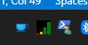
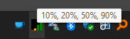

# Xbox Wireless Controller Battery Levels

A simple .NET tray application that displays the battery level of your Xbox Wireless Controller(s).

## Installation
Just download and run the latest release from the [releases page](releases).

## Features

- Displays the battery level of up to 4 Xbox Wireless Controllers
- Displays the battery level in percent on mouse hover

## Screenshots

